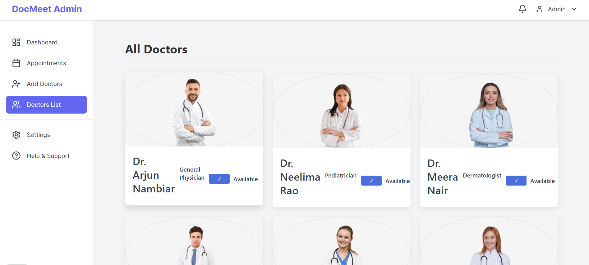
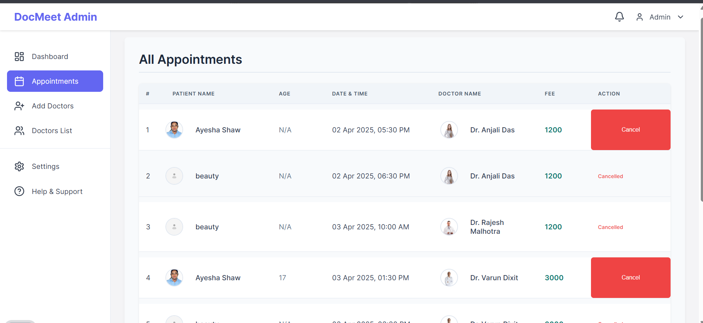
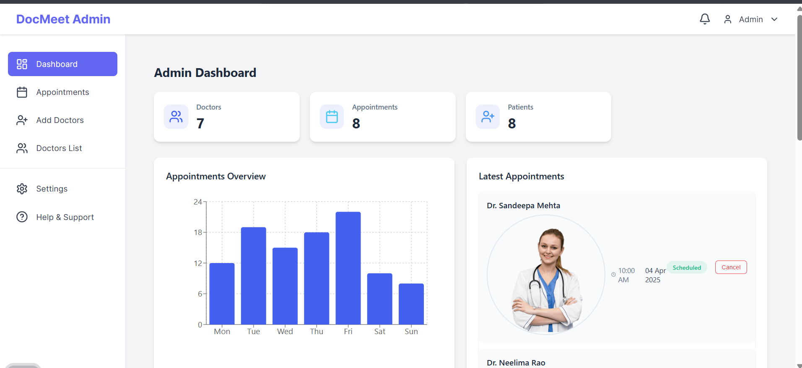
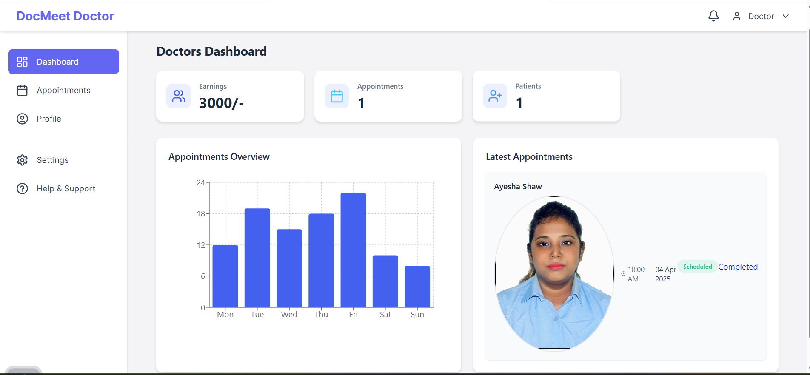
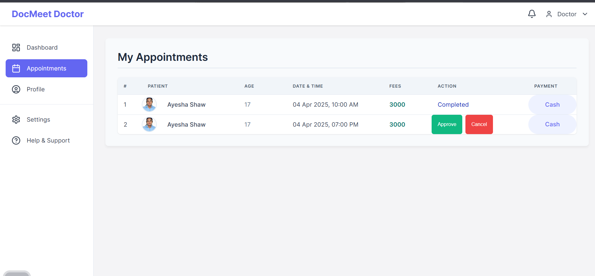

# DoctMeet Admin Panel 🌟

The DoctMeet Admin Panel is a comprehensive dashboard designed for managing the DoctMeet platform. It features two distinct administrative roles:

- **System Admin** 🛠️: Has complete control over the platform, including the management of all doctors, users, and system-wide appointments.
- **Doctor Admin** 👨‍⚕️: Can manage their own profile, appointments, and patient records.

**Deployed Link**: https://docmeet-g0lg.onrender.com/admin

**Admin Credentials**:  
- Email: admin@docmeet.com  
- Password: admin@123  

If you need admin access for any doctor, use the following credentials:  
- Email: sandeepa.mehta@docMeet.com  
- Password: 123456  

Alternatively, you can add a doctor using the admin account and check their data on the doctor dashboard.

## Features

### System Admin Features

#### Doctor Management

- View and manage all doctor profiles. 👩‍⚕️
- Approve or reject doctor registrations. ✅❌
- Monitor doctor availability and performance. 📊
- Set doctor specializations and departments. 🏥

#### System-Wide Appointment Management

- View and manage all appointments across the platform. 📅
- Track appointment statuses and analytics. 📈
- Handle scheduling conflicts and emergency cases. ⚠️
- Generate appointment reports. 📄

#### Admin Dashboard

- Comprehensive user account management. 🔑
- Role-based access control and permissions. 🔒
- System-wide activity monitoring. 👁️‍🗨️
- Platform analytics and reporting. 📊

### Doctor Admin Features

#### Doctor Profile Management

- Update personal and professional information. ✏️
- Manage credentials and certifications. 📜
- Set availability schedules. ⏰
- Update specializations and services offered. 💼

#### Doctor Dashboard

- Track daily, monthly, and yearly earnings. 💰
- View earnings analytics and trends. 📊
- Monitor appointment statistics. 📅
- Generate revenue reports. 📈

#### Appointment Management

- View and manage incoming appointment requests. 📬
- Approve or reject patient appointments. ✅❌
- Access detailed patient information. 📋
- Manage appointment schedules and availability. 📆
- Send notifications for appointment status updates. 🔔

## Tech Stack

- **Frontend**: React + Vite ⚛️
- **State Management**: React Context 🗂️
- **Styling**: CSS 🎨
- **Authentication**: JWT 🔐

## Getting Started

### Prerequisites

- Node.js (version 14 or higher) 🌐
- npm or yarn 📦

### Installation

1. Clone the repository. 🖥️
2. Navigate to the admin-panel directory:
   ```bash
   cd admin-panel
   ```
3. Install dependencies:
   ```bash
   npm install
   ```
4. Create a `.env` file with the required environment variables:
   ```
   VITE_API_URL=your_backend_url
   ```
5. Start the development server:
   ```bash
   npm run dev
   ```

## Project Structure

```
src/
  ├── components/     # Reusable UI components 📦
  ├── context/        # React Context for state management 📜
  ├── pages/          # Page components 📄
  ├── assets/         # Static assets 🖼️
  └── App.jsx         # Main application component 📱
```

## Available Scripts

- `npm run dev` - Start the development server. 🚀
- `npm run build` - Build for production. 🏗️
- `npm run preview` - Preview the production build. 👀

## Contributing

1. Create a feature branch. 🌿
2. Commit your changes. 💾
3. Push to the branch. 📤
4. Create a Pull Request. 🤝

## License

This project is licensed under the MIT License. 📝# DoctMeet Admin Panel 🌟

The DoctMeet Admin Panel is a comprehensive dashboard designed for managing the DoctMeet platform. It features two distinct administrative roles:

- **System Admin** 🛠️: Has complete control over the platform, including the management of all doctors, users, and system-wide appointments.
- **Doctor Admin** 👨‍⚕️: Can manage their own profile, appointments, and patient records.

**Deployed Link**: https://docmeet-g0lg.onrender.com/admin

**Admin Credentials**:  
- Email: admin@docmeet.com  
- Password: admin@123  

If you need admin access for any doctor, use the following credentials:  
- Email: sandeepa.mehta@docMeet.com  
- Password: 123456  

Alternatively, you can add a doctor using the admin account and check their data on the doctor dashboard.

## Features

### System Admin Features

#### Doctor Management

- View and manage all doctor profiles. 👩‍⚕️
- Approve or reject doctor registrations. ✅❌
- Monitor doctor availability and performance. 📊
- Set doctor specializations and departments. 🏥

#### System-Wide Appointment Management

- View and manage all appointments across the platform. 📅
- Track appointment statuses and analytics. 📈
- Handle scheduling conflicts and emergency cases. ⚠️
- Generate appointment reports. 📄

#### Admin Dashboard

- Comprehensive user account management. 🔑
- Role-based access control and permissions. 🔒
- System-wide activity monitoring. 👁️‍🗨️
- Platform analytics and reporting. 📊

### Doctor Admin Features

#### Doctor Profile Management

- Update personal and professional information. ✏️
- Manage credentials and certifications. 📜
- Set availability schedules. ⏰
- Update specializations and services offered. 💼

#### Doctor Dashboard

- Track daily, monthly, and yearly earnings. 💰
- View earnings analytics and trends. 📊
- Monitor appointment statistics. 📅
- Generate revenue reports. 📈

#### Appointment Management

- View and manage incoming appointment requests. 📬
- Approve or reject patient appointments. ✅❌
- Access detailed patient information. 📋
- Manage appointment schedules and availability. 📆
- Send notifications for appointment status updates. 🔔

## Tech Stack

- **Frontend**: React + Vite ⚛️
- **State Management**: React Context 🗂️
- **Styling**: CSS 🎨
- **Authentication**: JWT 🔐

## Getting Started

### Prerequisites

- Node.js (version 14 or higher) 🌐
- npm or yarn 📦

### Installation

1. Clone the repository. 🖥️
2. Navigate to the admin-panel directory:
   ```bash
   cd admin-panel
   ```
3. Install dependencies:
   ```bash
   npm install
   ```
4. Create a `.env` file with the required environment variables:
   ```
   VITE_API_URL=your_backend_url
   ```
5. Start the development server:
   ```bash
   npm run dev
   ```

## Project Structure

```
src/
  ├── components/     # Reusable UI components 📦
  ├── context/        # React Context for state management 📜
  ├── pages/          # Page components 📄
  ├── assets/         # Static assets 🖼️
  └── App.jsx         # Main application component 📱
```

## Available Scripts

- `npm run dev` - Start the development server. 🚀
- `npm run build` - Build for production. 🏗️
- `npm run preview` - Preview the production build. 👀

## Contributing

1. Create a feature branch. 🌿
2. Commit your changes. 💾
3. Push to the branch. 📤
4. Create a Pull Request. 🤝

## License

This project is licensed under the MIT License. 📝# DoctMeet Admin Panel 🌟

The DoctMeet Admin Panel is a comprehensive dashboard designed for managing the DoctMeet platform. It features two distinct administrative roles:

- **System Admin** 🛠️: Has complete control over the platform, including the management of all doctors, users, and system-wide appointments.
- **Doctor Admin** 👨‍⚕️: Can manage their own profile, appointments, and patient records.

**Deployed Link**: https://docmeet-g0lg.onrender.com/admin

**Admin Credentials**:  
- Email: admin@docmeet.com  
- Password: admin@123  

If you need admin access for any doctor, use the following credentials:  
- Email: sandeepa.mehta@docMeet.com  
- Password: 123456  

Alternatively, you can add a doctor using the admin account and check their data on the doctor dashboard.

## Features

### System Admin Features

#### Doctor Management

- View and manage all doctor profiles. 👩‍⚕️
- Approve or reject doctor registrations. ✅❌
- Monitor doctor availability and performance. 📊
- Set doctor specializations and departments. 🏥

#### System-Wide Appointment Management

- View and manage all appointments across the platform. 📅
- Track appointment statuses and analytics. 📈
- Handle scheduling conflicts and emergency cases. ⚠️
- Generate appointment reports. 📄

#### Admin Dashboard

- Comprehensive user account management. 🔑
- Role-based access control and permissions. 🔒
- System-wide activity monitoring. 👁️‍🗨️
- Platform analytics and reporting. 📊

### Doctor Admin Features

#### Doctor Profile Management

- Update personal and professional information. ✏️
- Manage credentials and certifications. 📜
- Set availability schedules. ⏰
- Update specializations and services offered. 💼

#### Doctor Dashboard

- Track daily, monthly, and yearly earnings. 💰
- View earnings analytics and trends. 📊
- Monitor appointment statistics. 📅
- Generate revenue reports. 📈

#### Appointment Management

- View and manage incoming appointment requests. 📬
- Approve or reject patient appointments. ✅❌
- Access detailed patient information. 📋
- Manage appointment schedules and availability. 📆
- Send notifications for appointment status updates. 🔔

## Tech Stack

- **Frontend**: React + Vite ⚛️
- **State Management**: React Context 🗂️
- **Styling**: CSS 🎨
- **Authentication**: JWT 🔐

## Getting Started

### Prerequisites

- Node.js (version 14 or higher) 🌐
- npm or yarn 📦

### Installation

1. Clone the repository. 🖥️
2. Navigate to the admin-panel directory:
   ```bash
   cd admin-panel
   ```
3. Install dependencies:
   ```bash
   npm install
   ```
4. Create a `.env` file with the required environment variables:
   ```
   VITE_API_URL=your_backend_url
   ```
5. Start the development server:
   ```bash
   npm run dev
   ```

## Project Structure

```
src/
  ├── components/     # Reusable UI components 📦
  ├── context/        # React Context for state management 📜
  ├── pages/          # Page components 📄
  ├── assets/         # Static assets 🖼️
  └── App.jsx         # Main application component 📱
```

## Available Scripts

- `npm run dev` - Start the development server. 🚀
- `npm run build` - Build for production. 🏗️
- `npm run preview` - Preview the production build. 👀

## Contributing

1. Create a feature branch. 🌿
2. Commit your changes. 💾
3. Push to the branch. 📤
4. Create a Pull Request. 🤝

## License

This project is licensed under the MIT License. 📝
