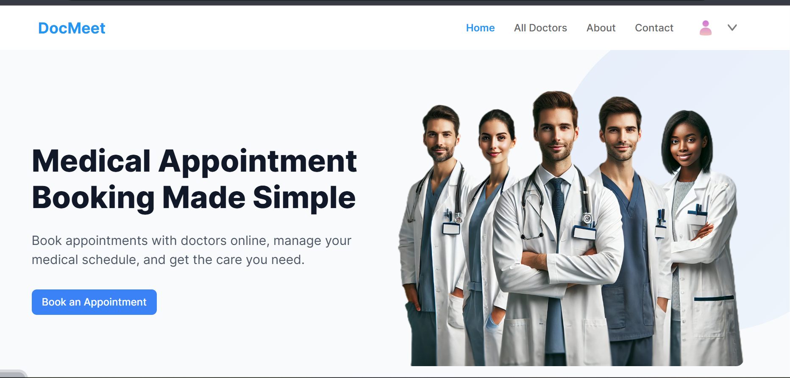
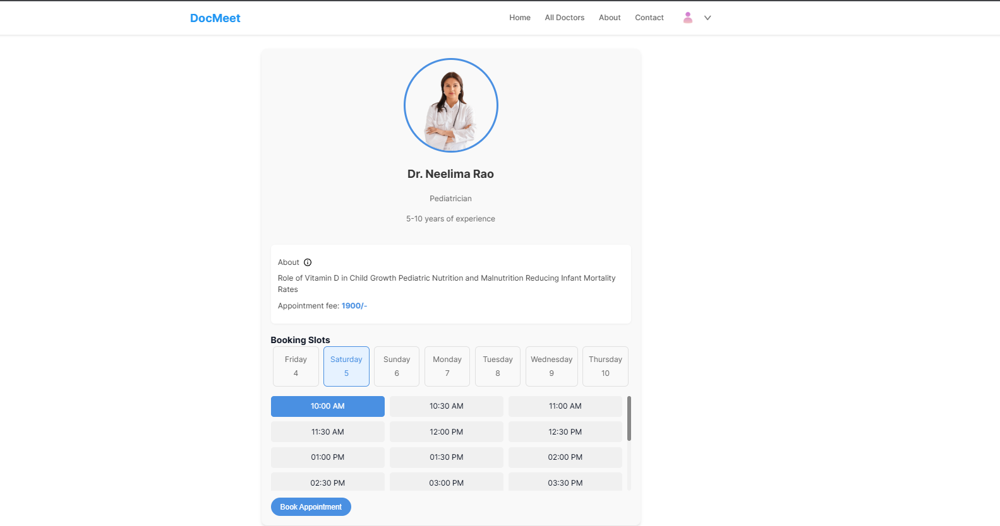
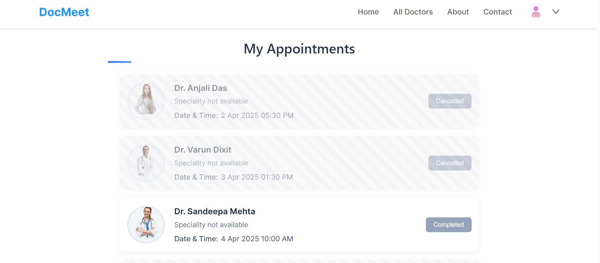

# DocMeet Frontend Documentation ✨

**Deployed Link:** https://docmeet-g0lg.onrender.com

To use the application, you need to register or log in.

## System Overview 🌐
The DocMeet frontend is a React-based web application designed to provide an intuitive interface for the doctor appointment booking system. It serves three types of users: patients, doctors, and administrators, each with dedicated interfaces and functionalities.

## Tech Stack ⚙️
- **Framework:** React with Vite
- **State Management:** React Context API
- **Routing:** React Router
- **Form Handling:** React Hook Form
- **API Integration:** Axios
- **Styling:** CSS 

## Key Features 🚀

### Patient Features 🩺
- User registration and login
- Profile management, including image upload
- Doctor search and filtering
- Appointment booking system
- Appointment management (view and cancel)
- Medical history tracking

### Doctor Features 👨‍⚕️👩‍⚕️
- Secure doctor login
- Profile management
- Appointment calendar view
- Patient appointment management
- Availability management
- Dashboard with analytics

### Admin Features 👔
- Doctor management (add, edit, and remove)
- User management
- Appointment oversight
- System analytics dashboard
- Management of doctor availability

## Project Structure 📁
```
frontend/
├── src/
│   ├── assets/        # Static assets (images, icons)
│   ├── components/     # Reusable UI components
│   ├── context/        # React Context providers
│   ├── pages/          # Page components
│   ├── App.jsx         # Main application component
│   └── main.jsx        # Application entry point
├── public/             # Public static files
├── index.html          # HTML entry point
└── vite.config.js      # Vite configuration
```

## Getting Started 🛠️

1. **Install dependencies:**
   ```bash
   npm install
   ```

2. **Set up environment variables:**
   Create a `.env` file in the root directory:
   ```
   VITE_API_URL=http://localhost:8080/api
   VITE_CLOUDINARY_URL=your_cloudinary_upload_url
   ```

3. **Start the development server:**
   ```bash
   npm run dev
   ```

4. **Build for production:**
   ```bash
   npm run build
   ```

## Development Guidelines 📏

### Component Structure
- Use functional components with hooks.
- Implement proper PropTypes.
- Follow component composition patterns.
- Keep components focused and reusable.

### State Management
- Use the Context API for global state management.
- Implement proper state isolation.
- Adhere to React's best practices for state management.

### Styling Guidelines 🎨
- Use CSS Modules for component styling.
- Follow the BEM naming convention.
- Maintain responsive design principles.
- Ensure accessibility compliance.

### API Integration 🌐
- Use Axios for API requests.
- Implement proper error handling.
- Follow RESTful best practices.
- Handle loading and error states effectively.

## Authentication 🔐
- JWT-based authentication.
- Implement protected routes.
- Role-based access control.
- Secure token storage.

## Error Handling 🚨
- Implement a global error boundary.
- Handle form validation errors.
- Manage API error handling.
- Provide user-friendly error messages.

## Performance Optimization ⚡
- Utilize code splitting.
- Implement lazy loading for components.
- Optimize images.
- Focus on bundle size optimization.

## Testing 🧪
- Conduct unit testing with Jest.
- Perform component testing with React Testing Library.
- Engage in integration testing.
- Conduct end-to-end testing with Cypress.

## Build and Deployment 🌟
1. **Create a production build:**
   ```bash
   npm run build
   ```

2. **Preview the production build:**
   ```bash
   npm run preview
   ```

3. **Deploy to your preferred hosting platform.**

## Interface Screenshots 📸

### Homepage

The homepage provides an intuitive interface for users to browse and search for doctors.

### Appointment Booking

Users can easily book appointments by selecting available time slots from the doctor's schedule.

### My Appointments

Patients can view and manage their upcoming and past appointments through a user-friendly dashboard.


## Browser Support 🌍
- Chrome (latest)
- Firefox (latest)
- Safari (latest)
- Edge (latest)

## Contributing 🤝
1. Fork the repository.
2. Create a feature branch.
3. Commit your changes.
4. Push to your branch.
5. Create a pull request.

## Security Measures 🔒
- Input sanitization.
- Prevention of XSS attacks.
- CSRF protection.
- Secure authentication.
- Implementation of protected routes.
